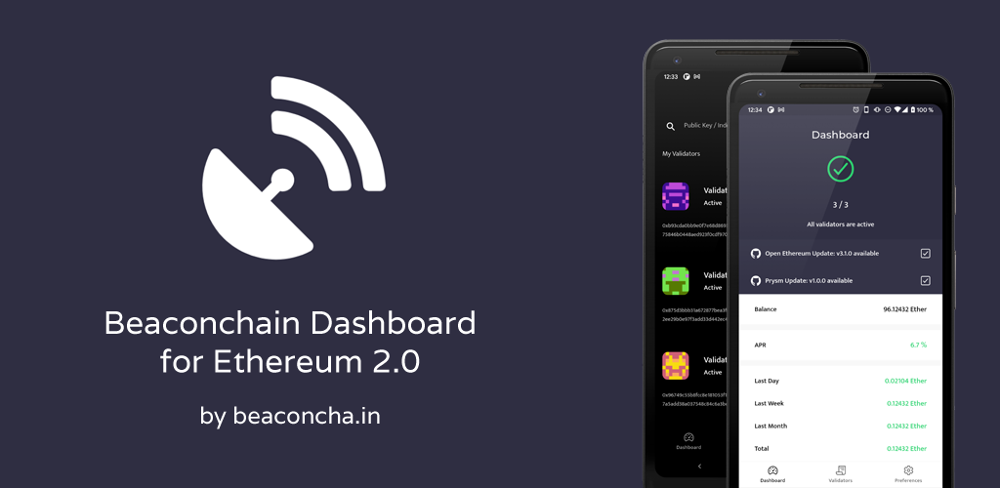

<p align="center">
  
</p>

<p align="center">
  <a href="https://github.com/gobitfly/eth2-beaconchain-explorer-app/actions/workflows/build.yaml">
    
  </a>
  <a href="https://play.google.com/store/apps/details?id=in.beaconcha.mobile">
    
  </a>
  <a href="https://apps.apple.com/app/beaconchain-dashboard/id1541822121">
    
  </a>
  <a href="https://github.com/gobitfly/eth2-beaconchain-explorer-app/blob/master/LICENSE">
    
  </a>
</p>

# 🔭 Beaconchain Dashboard

**Open‑source validator performance tracker for Ethereum and Gnosis** – available on Android & iOS.

Built with Angular, Ionic, and Capacitor. Uses the [beaconcha.in](https://beaconcha.in) API.

<p align="center">
  <a href="https://play.google.com/store/apps/details?id=in.beaconcha.mobile">
    
  </a>
  <a href="https://apps.apple.com/app/beaconchain-dashboard/id1541822121">
    
  </a>
</p>

---

## 📖 About

Beaconchain Dashboard is an **Angular** application written in TypeScript, HTML & CSS.  
It leverages the **Ionic framework** for mobile UI components and **Ionic Capacitor** as a bridge to native device features.

---

## ✨ Features

| Category | Supported |
|----------|-----------|
| ⛓️ **Networks** | Ethereum Mainnet, Gnosis Chain (also testnets) |
| 📊 **Validator Monitor** | Online status, balances, returns, performance |
| 🔔 **Alerts** | Missed blocks, proposals, validator exits |
| 💰 **Block Rewards** | Execution + consensus rewards overview |
| 🖥️ **Machine Monitoring** | CPU usage, network usage, and more |
| 🚀 **Rocketpool** | Minipool tracking and RPL rewards |
| 🧩 **Partial Staking** | Custom stake share for shared validators |
| 📱 **Dashboard** | Combined view for up to 280 validators |
| ⚠️ **Network Warnings** | Client update notifications, network health |
| 💱 **Multi‑currency** | Support for various fiat currencies |
| 🌓 **Theme** | Light theme & Dark theme |

---

## 📱 Device Support

- **Android**: 5.1 (Lollipop) or newer  
- **iOS**: 13.0 or newer

---

## 🛠️ Development

### Prerequisites

- Node.js 16+
- For Android: [Android Studio](https://developer.android.com/studio) (2022.2.1+), Android SDK  
- For iOS: macOS (Monterey 12.5+), Xcode 14.1+

### Getting Started

```bash
# Clone the repository
git clone https://github.com/gobitfly/eth2-beaconchain-explorer-app.git
cd eth2-beaconchain-explorer-app

# Install global dependencies
npm install -g @ionic/cli native-run cordova-res

# Install project dependencies
npm i
```

> **Note**: You must provide your own `google-services.json` (Android) and `GoogleService-Info.plist` (iOS) for Firebase integration.

### Run in Browser

```bash
npm run-script serve
```

Starts a local web server with live‑reload at `http://localhost:8100`.

### Android

```bash
# Build once
ionic build

# Live‑reload on device
ionic cap run android --livereload --external --host=<YOUR_IP> --disableHostCheck --configuration=development

# Production build
npm run-script build-android-for-production
```

### iOS

```bash
# Build once
ionic build

# Live‑reload on device
ionic cap run ios --livereload --external --host=<YOUR_IP> --disableHostCheck --configuration=development

# Production build
npm run-script build-ios-for-production
```

### Best Practices for Contributors

- Use shared components for reusable UI elements.
- Use Angular pipes for currency conversion or value formatting.
- Always support **light and dark themes** – use CSS variables (defined in `src/app/theme/variables.scss` and `global.scss`).
- Follow Angular style guide and keep code modular.

---

## 📄 License

Distributed under the **GNU General Public License v3.0**.  
See [`LICENSE`](LICENSE) for more information.

---

## 👨‍💻 Maintainer

**Mahdi Amolimoghaddam** – Independent developer and maintainer.  

- GitHub: [@Mahdiamoli](https://github.com/Mahdiamoli)  
- Project Repository: [gobitfly/eth2-beaconchain-explorer-app](https://github.com/gobitfly/eth2-beaconchain-explorer-app)

---

<p align="center">
  Built with ❤️ for the Ethereum staking community.
</p>